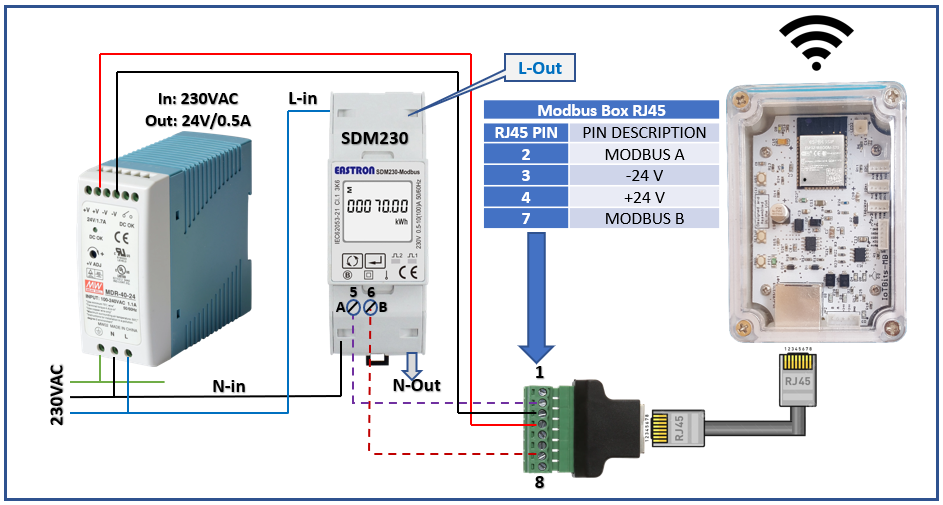
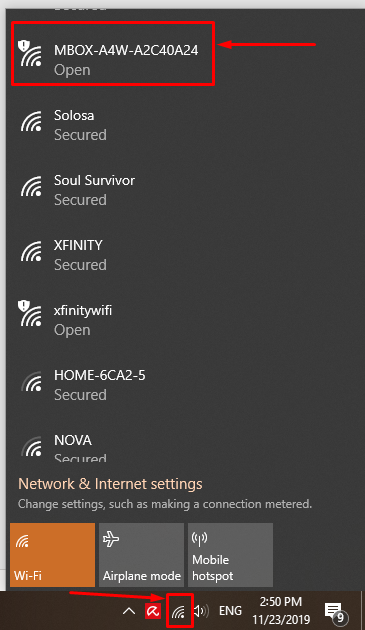
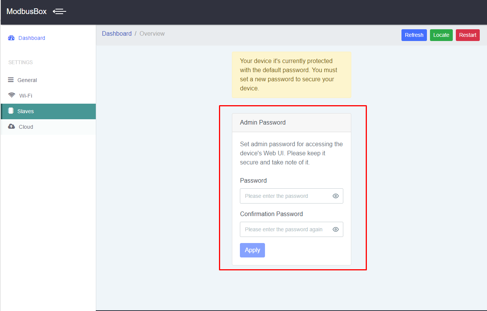
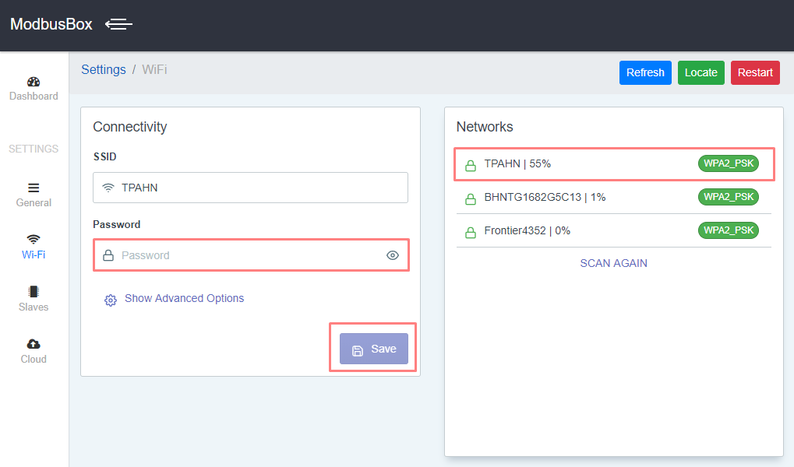
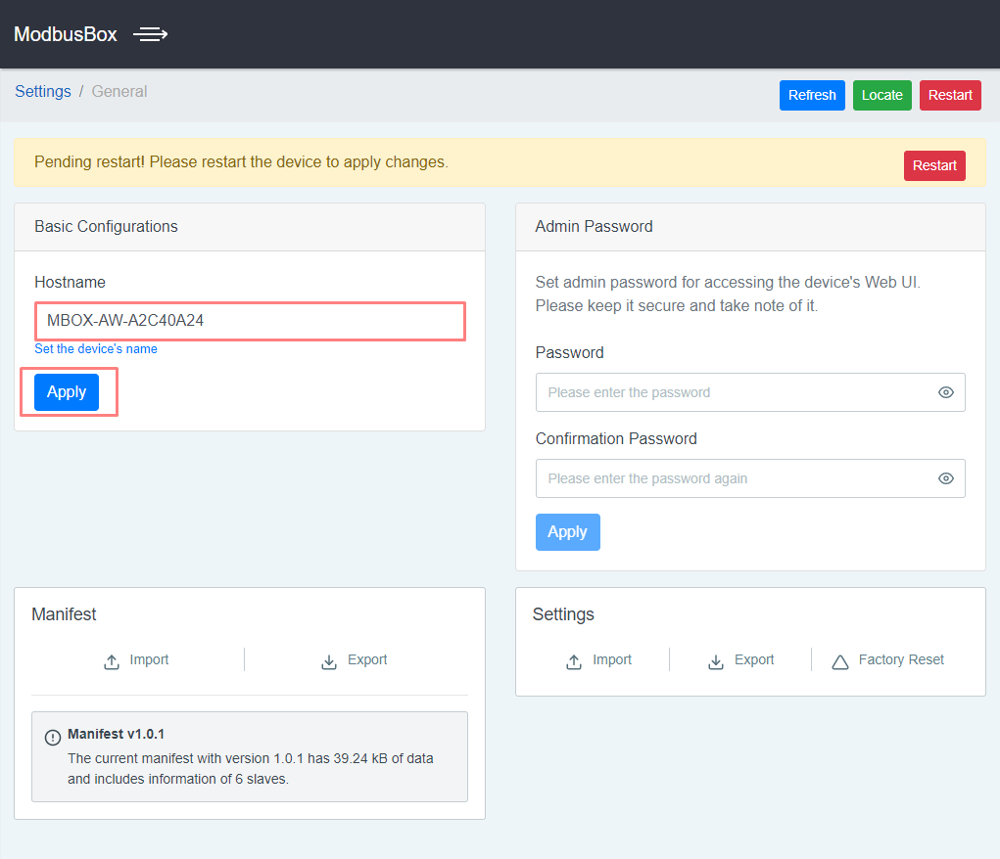
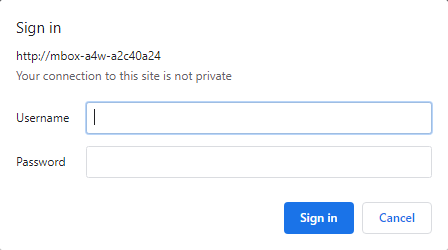
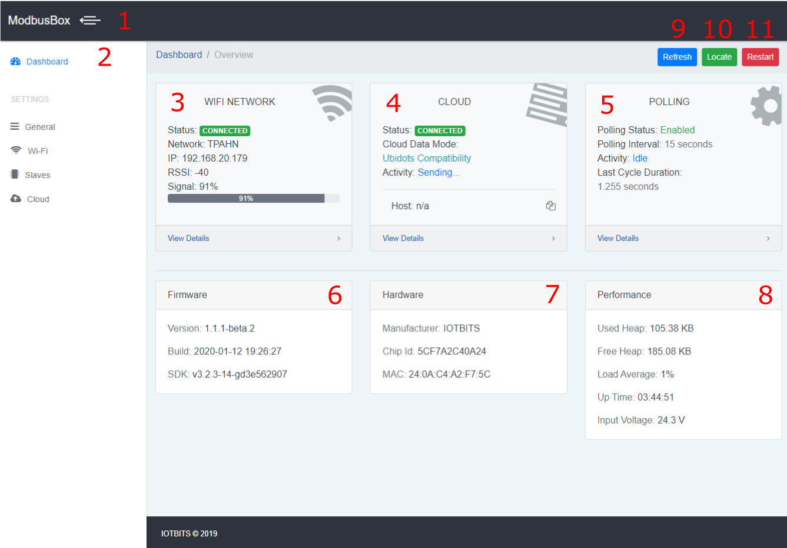

# Connecting ModbusBox to Ubidots

This documentation aim to guide through the process of getting the ModbusBox connected to Ubidots.

## Introduction

ModbusBox is easy to use thanks to its embedded Web-UI accessible via Wi-Fi.  When device is brand new or Wi-Fi hasn’t been set it can be configured as a  access point mode (AP).  Client mode is running all time after its connected to your local Wi-Fi network which make it very convenient for re- configure the device remotely while connected to your Local Wi-Fi network.  ModbusBox is capable to read data registers from Modbus slaves^ and send data periodically to cloud or local IoT services using the very popular MQTT protocol. Data is serialized using JSON format, so it's very easy to parse the information on the IoT server.  Slaves variables can be processed and displayed in Ubidots dashboards. Our ModbusBox has been focused primarily to be used with VFD ( Variable Frequency Drive) but as I mention before  it can be used with any device that handles Modbus RTU. One Key fact with ModbusBox its easy to use and deploy with Ubidots, no programming  is required.

^ *At this time the device allows a maximum of four slaves , but our next firmware release would have the option for up to six slaves.*

## Requirements

* Ubidots Account
* ModbusBox
* Modbus RTU slave ^

^ *If the slave type isn’t listed, you can edit the ModbusBox manifest file and add your own device*

## Step-By-Step

1. Sample integration scheme with Ubidots

2. Hardware overview

3. Connecting ModbusBox to a Wi-Fi network

4. ModbusBox general configuration

5. ModbusBox slave configuration

6. ModbusBox cloud configuration (Ubidots)

   

## 1. Sample integration scheme with Ubidots

**Figure 1**

## 2. Hardware overview

Please observe carefully the ModbusBox hardware, we recommend to print this section for a better understanding of any further explanation of the modbus usage and setup.

| Number | Name                    | Function                                                     |
| :----: | ----------------------- | ------------------------------------------------------------ |
|   1    | RJ45 Connector          | DC power input and Modbus connection                         |
|   2    | Programming Mode Button | Used to put the device in programming mode (**for developers**) |
|   3    | Setup Mode Button       | Combined with reset enters the ModbusBox in setup mode       |
|   4    | Reset Button            | Reset the ModbusBox (used combined with 2 and 3)             |
|   5    | Activity LED            | MQTT activity white LED                                      |
|   6    | Wi-Fi Module            | Wi-Fi antenna                                                |
|   7    | Status LED              | RGB pixel LED to indicate ModbusBox statuses                 |
|   8    | Dev Options             | Connectors (**for developers**)                              |
|   9    | Modbus Interface LEDs   | Indicate Modbus Tx/Rx activity                               |
|   10   | Power LED               | Green LED - indicate power presence                          |
|   11   | Power/Modbus            | Secondary power & modbus connector (**for developers**)      |

**Table 1**

**Figure 2**

IOTBITS provides two different commercial model of the ModbusBox:

* MB-B1W - Supports only 1 slave
* MB-A4W - Supports up to 4 slaves

Both devices are identical from the hardware point of view. What makes them different is the the firmware  variation inside the microcontroller. Model MB-B1W supports only one slave while MB-A4W supports up to four slaves, being able to read from all of them at the time.

**Figure 3** shows the required wiring to connect ModbusBox to a cheap Eastron Energy meter. Please notice that in order to power the ModbusBox, a 12v - 24v DC power supply is required. 

**Figure 3**

### Control Buttons

As you can see in **Figure 4**, there are three control buttons located on the PCB. These control buttons allows the user to switch between operation modes and to perform other advanced procedures.

**Figure 4**

The **Setup** control button is used to put the device in **Setup Mode** and the Reset control button is used to perform a Factory Reset. 

When the ModbusBox is started with its factory configuration, there is no procedure required to enter in setup mode, in such scenario the device enters automatically in setup mode as soon it powers on. When in Setup Mode a Wi-Fi network search can take place in your Android/iOS mobile device or PC and look for SSID name **MB-B1W**  or **MB-A4W** follow by other characters that represents the unique identification of the chip as shown bellow in **Figure 5**.

**Figure 5**

**Setup Mode** : Press and hold **Setup** button and then press and release **Reset** button while holding **Setup** button for  3 seconds or until status LED shown in **Figure 2** change from fading pattern to fast green, then search Wi-Fi SSID name in your phone or PC as described previously.

**Programing Mode :** This mode is only for developers that get the ModbusBox without any firmware loaded  on it and want to upload their own firmware. To enter into this mode, press and hold  **Programming** button and  quick press and release  **Reset** button. 

**Factory Reset :** To perform a factory reset, press and hold **Setup** button then quick press of Reset button, keeping pressed **Setup** button for about 10 seconds until status LED turns off and quick turn on back again with the LED fading in green color. After performing a factory reset, the ModbusBox enters automatically in **Setup Mode** and any previous configuration from the device is removed. 

### LEDs indicators

LEDs indicators on the device are very useful to quickly understand the operational status of the ModbusBox. They also helps to troubleshoot any problem with the device operation. 

The following tables shows the LEDs behaviors.

| Number in figure 2 | Name on PCB | What is does                    | Description                                                  |   Color   |
| :----------------: | :---------: | :------------------------------ | :----------------------------------------------------------- | :-------: |
|         10         |     D3      | Indicates DC input voltage      | When OFF indicates no power voltage detected                 |     🟢     |
|         5          |     D9      | Indicates MQTT activity         | It flashes every time an MQTT message is sent or received    |     ⚪     |
|         9          |     D4      | Modbus master request           | It blinks when ModbusBox try to communicate with modbus slave | &#x1F535; |
|         9          |     D8      | Modbus Response from from slave | Its blink when ModbusBox has received a response from slave  |     🔴     |

**Table 2**

#### Status LED Colors

The **Status LED**, labeled as **D12** on the PCB and marked with number 7 in **Figure 2**, is color dependent upon device statuses and alarms.

The following tables shows the color patterns of different statuses and alarms indications of the **Status LED** on the ModbusBox.

##### Status Color Patterns 

| Status                      | Animation  |   Color    | HSL Color Code |
| --------------------------- | :--------: | :--------: | :------------: |
| Setup Mode                  | Quick fade |     🟢      |      115       |
| System OK                   | Slow fade  | AQUAMARINE |      174       |
| Connecting to Wi-Fi network | Quick fade | &#x1F535;  |      240       |
| Connecting to MQTT          | Quick fade | &#x1F535;  |      240       |

**Table 3.1**

##### Alarm Color Patterns

| Status              | Animation  | Color | HSL Color Code |
| ------------------- | :--------: | :---: | :------------: |
| No Wi-Fi connection | Quick fade |   🔴   |       0        |
| No MQTT connection  | Quick fade |   🟣   |      300       |
| Modbus failure      | Quick fade |   🟠   |       60       |

**Table 3.2**

## 3. Connecting ModbusBox to a Wi-Fi network

Before going ahead with the next instructions make sure the ModbusBox is powered following the instruction on section 2.2 as is was previously described **Setup Mode** allows to do the following:

- Connect ModbusBox to the Wi-Fi
- Edit ModbusBox name
- Add and configure modbus slaves
- Check and test modbus slaves readings and functions
- Setup cloud connectivity to Ubidots
- Backup/Restore ModbusBox settings ^
- Backup/Restore modbus slaves configuration ^
- Download modbus slaves manifest ^
- Upload new or modified slave manifest

^ *Not Covered in this tutorial*

Power up ModbusBox with a suitable 12v -24v power supply following the indications on Figure 3. Make sure the **Status LED** is fading green 🟩, if it's not, probably ModbusBox had been setup before. If that's the case, proceed to press **Setup** Button while quickly press and Release reset button, wait 2 seconds until the **Status LED** starts fading green 🟩.

#### Accessing ModbusBox WebUI in Setup Mode

* Click on Wi-Fi connection and look for Wi-Fi station that starts with **MBOX**.

**Figure 6**

* Connect to the ModbusBox AP which is open by default, no password required to connect at initial setup.

* Open Google Chrome and type the IP Address of the ModbusBox, which is **192.168.4.1** when the device is in Setup Mode.

* Once the Web-UI opens, it will ask you to change the default password. The new password will be used to access the Web-UI through the LAN when the device is connected to the Wi-Fi network or in Setup Mode if required to do any modification to its configuration.

  

**Figure 7**

#### Connecting ModbusBox to a Wi-Fi network

* Select **Wi-Fi** option on the vertical navbar. 

  

**Figure 8**

* In the Networks section at the right side of the page, click on **Scan** to perform a Wi-Fi network scan. When the scanning process is completed, a list of available networks will show up. 

**Figure 9**

* Select the one you have access to and enter the password, then click on Save. 

> Please notice the indication of **pending restart required**, but you may continue without restarting since we need to set other options that will facilitate connecting to the ModbusBox after it is connected to the Wi-Fi that you have selected. 

**Figure 10**

## 4. ModbusBox general configuration

Let's move to the general configuration section by selecting the **General** tab on the vertical navbar.

This configuration section allows change the hostname, update the admin password and import/export settings and the manifest file. 

At this time we will only change the device hostname to easily connect to the ModbusBox Web-UI once it connects to the Wi-Fi network and we wont know the assigned IP by the Wi-Fi router.

* Change the hostname, then click apply to save the changes.

  > If the ModbusBox resets for an unexpected reason while editing, make sure you still connected to the ModbusBox Wi-Fi Access Point and check the Status LED is still fading in green color. If not, please put the ModbusBox in Setup Mode by pressing the Setup Button and quickly pressing and releasing reset button.

**Figure 11**

The next step to follow is adding modbus slaves and setup the cloud connectivity (MQTT). It’s perfectly possible to continue in Setup Mode to complete the entire setup, but at this point we prefer to  just restart the ModbusBox and access the ModbusBox Web-UI via the IP assigned by the Wi-Fi router. 

Click restart on the Web-UI or simple press reset button on the ModbusBox.

#### Finishing ModbusBox setup while connected to Wi-Fi network

As previously commented, the following instructions are to complete the configuration of the ModbusBox that we didn’t finish during setup mode. 

After resetting the device we would notice the Status LED is fading in a light blue color that is indication that is connected to Wi-Fi but isn’t connected to cloud service. 

As you can see in **Figure 10**, we connect the ModbusBox to the Wi-Fi access point named "TPAHN", so we must connect the mobile device or computer to the same Wi-Fi network. 

To easily access to the Web-UI just type in your browser the hostname that we set as shown in **Figure 11**. 

Ex: http://MBOX-AW-A2C40A24:80  

A popup window will appear asking for the username and password. The username is always **admin** and the password that you set as shown in **Figure 7**. 

**Figure 12**

After successfully entered the credentials, you will be redirected to the dashboard. The dashboard contain useful information as shown below.

**Figure 13**

#### Dashboard description

| Number in figure | Description                                                  |
| :--------------: | ------------------------------------------------------------ |
|        1         | Hide/Show vertical navbar (number 2 in figure).              |
|        2         | Vertical navbar with direct access to the menus.             |
|        3         | Show information related to the Wi-Fi connectivity. Network SSID, IP Address assigned by the router, and Wi-Fi signal level. |
|        4         | Show information related to the cloud server, MQTT activity and topics automatically created based on the modbus slaves added by the user. |
|        5         | Shows Modbus polling data, like polling interval, cycle duration and modbus activity. |
|        6         | Shows firmware version, build date and sdk version.          |
|        7         | Shows the MAC Address and the Chip ID of the ModbusBox device. |
|        8         | Basic performance monitor that shows the amount of memory in use, the load percentage of the microcontroller and input voltage. |
|        9         | Button to reload the current page (Use this option in case the page fail to load) |
|        10        | This option allows you to locate the ModbusBox by making the Status LED to flash for two seconds in green color. |
|        11        | This button restarts the device.                             |

## 5. ModbusBox slave configuration

Working on it...

## 6. ModbusBox cloud configuration (Ubidots)

Working on it...